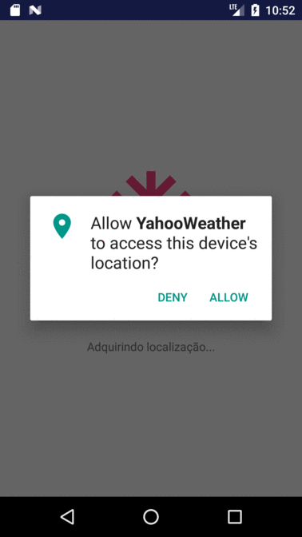

# Yahoo Weather Forecast Android demo
A simple app using the [YahooWeather API](https://developer.yahoo.com/weather/) and the new Architecture Components Library ([LiveData](https://developer.android.com/topic/libraries/architecture/livedata.html) and [ViewModel](https://developer.android.com/topic/libraries/architecture/viewmodel.html)).

## Getting started
Clone the repository and import the project in Android Studio, you can try the app installing the `demo.apk` available in the project root.

## Dependencies
The depdendencies for the project are described in the Gradle script `build.gradle` of the app, just sync the project in Android Studio and you are ready to go :)

List of libraries used in the project so far
- [LiveData](https://developer.android.com/topic/libraries/architecture/livedata.html) - LiveData is a data holder class that keeps a value and allows this value to be observed. Unlike a regular observable, LiveData respects the lifecycle of app components, such that the Observer can specify a Lifecycle in which it should observe.
- [ViewModel](https://developer.android.com/topic/libraries/architecture/viewmodel.html) - The ViewModel class is designed to store and manage UI-related data so that the data survives configuration changes such as screen rotations.
- [Room](https://developer.android.com/topic/libraries/architecture/room.html) - Room provides an abstraction layer over SQLite to allow fluent database access while harnessing the full power of SQLite.
- [Butterknife](https://github.com/JakeWharton/butterknife) - A view injection library that makes the binding between views, methods and resourses declared in XML and the activities/fragments classes.
- [Retrofit/OKhttp](http://square.github.io/retrofit/) - A type-safe REST client for Android and Java
- [Gson](https://github.com/google/gson) - Gson is a Java library that can be used to convert Java Objects into their JSON representation.

## Running it
You can [build and run](https://developer.android.com/tools/building/building-studio.html) the project using the Android Studio/Gradle. You need an [android emulator](http://developer.android.com/tools/devices/emulator.html) or a [real device](http://developer.android.com/tools/device.html) to test the build.

## Screenshots
